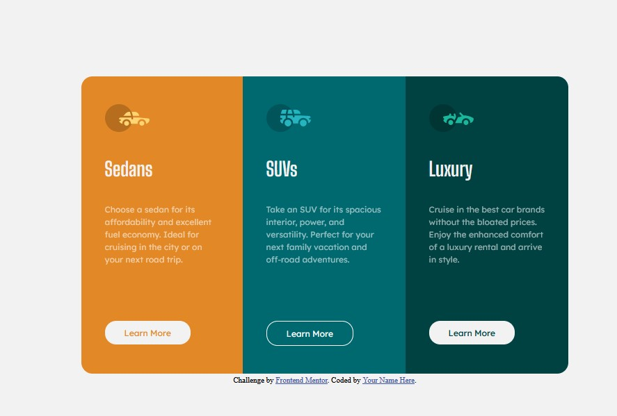

# Frontend Mentor - 3-column preview card component solution

This is a solution to the [3-column preview card component challenge on Frontend Mentor](https://www.frontendmentor.io/challenges/3column-preview-card-component-pH92eAR2-). Frontend Mentor challenges help you improve your coding skills by building realistic projects. 

## Table of contents

- [Overview](#overview)
  - [The challenge](#the-challenge)
  - [Screenshot](#screenshot)
  - [Links](#links)
- [Author](#author)
- [Acknowledgments](#acknowledgments)

## Overview

### The challenge

Users should be able to:

- View the optimal layout depending on their device's screen size
- See hover states for interactive elements

### Screenshot

### Links

- Solution URL: [Add solution URL here](https://your-solution-url.com)
- Live Site URL: [Add live site URL here](https://your-live-site-url.com)

## My process

### Built with

- Semantic HTML5 markup
- CSS custom properties
- Flexbox
- CSS Grid
- Mobile-first workflow

## Author

- Frontend Mentor - [@ashwanipydev](https://www.frontendmentor.io/profile/ashwanipydev)
- Twitter - [@CodeWithMeaning](https://twitter.com/CodeWithMeaning)

## Acknowledgments

Special thanks to Frontend Mentor (frontendmentor.com) for providing engaging coding challenges, Kevin Powell's YouTube channel for insightful web development tutorials, Hitesh Choudhary's CodeWithHarry for valuable coding guidance, and Love Babbar for sharing programming knowledge. Their contributions have greatly enriched the learning experience. 
frontendmentor.com COMMUNITY FEEDBACK
-Deepak -[@itsdevdeepak](https://www.frontendmentor.io/profile/itsdevdeepak)
-hitmorecode -[@hitmorecode](https://www.frontendmentor.io/profile/hitmorecode)

**Have fun building!** 🚀

